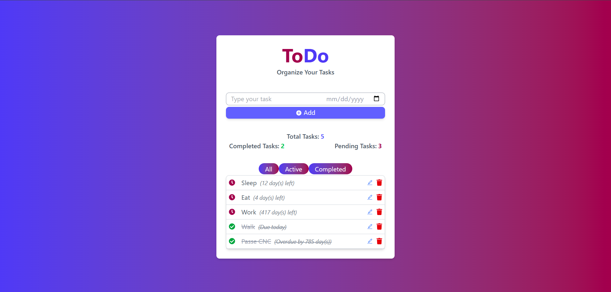
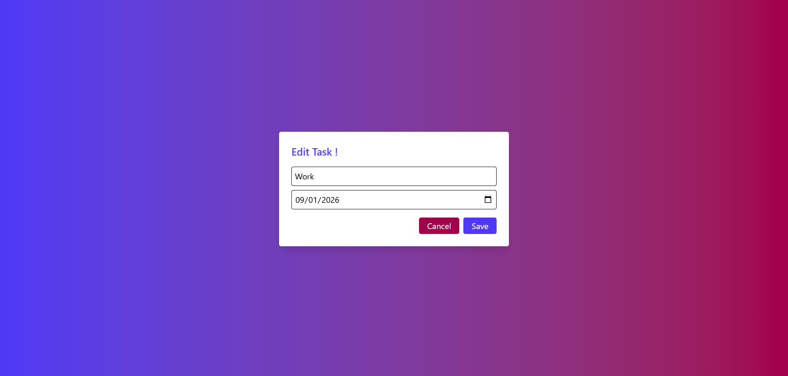

# Technical Test - Todo Application

A modern, responsive Todo application built with React and Vite, featuring a clean UI powered by Tailwind CSS.

## App Preview
  


## 🚀 Features

- **Add, Edit, and Delete Todos**: Full CRUD operations for managing todo items
- **Responsive Design**: Optimized for desktop and mobile devices
- **Modern UI**: Clean and intuitive interface using Tailwind CSS
- **Fast Development**: Hot Module Replacement (HMR) for rapid development
- **Type Safety**: Built with modern React patterns and best practices

## 🛠️ Technology Stack

- **Frontend Framework**: React 19.1.0
- **Build Tool**: Vite 7.0.4
- **Styling**: Tailwind CSS 4.1.11
- **Icons**: React Icons 5.5.0
- **Linting**: ESLint with React-specific rules
- **Package Manager**: npm

## 📦 Installation

1. **Clone the repository**
   ```bash
   git clone https://github.com/Emmetthazel/GetItDone.git
   cd TodoApplication
   ```

2. **Install dependencies**
   ```bash
   npm install
   ```

3. **Start the development server**
   ```bash
   npm run dev
   ```

4. **Open your browser**
   Navigate to `http://localhost:5173` to view the application

## 🎯 Available Scripts

- `npm run dev` - Start development server with HMR
- `npm run build` - Build for production
- `npm run preview` - Preview production build locally
- `npm run lint` - Run ESLint to check code quality

## 📁 Project Structure

```
TodoApplication/
├── public/              # Static assets
├── src/
│   ├── components/      # React components
│   │   ├── Todo.jsx     # Main Todo component
│   │   └── TodoItems.jsx # Todo items list component
│   ├── assets/          # Project assets
│   ├── App.jsx          # Main App component
│   ├── main.jsx         # Application entry point
│   └── index.css        # Global styles
├── package.json         # Dependencies and scripts
├── vite.config.js       # Vite configuration
└── README.md           # Project documentation
```

## 🎨 Features Overview

### Todo Management
- Create new todo items
- Mark todos as complete/incomplete
- Edit existing todo content
- Delete todos
- Persistent state management

### User Experience
- Intuitive and responsive interface
- Smooth animations and transitions
- Mobile-friendly design
- Fast loading and interactions

## 🔧 Development

This project uses modern React patterns and is set up for efficient development:

- **Fast Refresh**: Instant updates during development
- **ESLint**: Code quality and consistency
- **Tailwind CSS**: Utility-first CSS framework for rapid UI development
- **Vite**: Lightning-fast build tool and dev server

## 📝 Contributing

1. Fork the repository
2. Create a feature branch (`git checkout -b feature/amazing-feature`)
3. Commit your changes (`git commit -m 'Add some amazing feature'`)
4. Push to the branch (`git push origin feature/amazing-feature`)
5. Open a Pull Request

## 📄 License

This project is part of a technical test.
